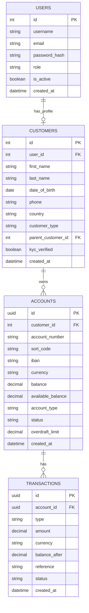

# UK Bank — Aplikacje Biznesowe 

Aplikacja bankowa symulująca brytyjski bank komercyjny, integrująca się z zewnętrznymi systemami rozliczeniowymi (Bacs, Faster Payments, CHAPS, SWIFT) oraz dostawcami kart płatniczych i przelewem natychmiastowym typu BLIK.

---
## 1. Zakres funkcjonalny

- **Przelew wewnętrzny** — transfer między rachunkami w obrębie naszego banku (bez udziału izb zewnętrznych).
- **Przelew Bacs** — standardowy międzybankowy przelew GBP w modelu DNS, z 3-dniowym cyklem rozliczeniowym (D+3). Integracja z API izby rozliczeniowej Pay.UK.
- **Przelew Faster Payments** — natychmiastowy przelew konsumencki 24/7, limit 1 000 000 GBP, czas < 2 minut. Integracja z API FPS.
- **Przelew CHAPS** — przelew wysokokwotowy typu RTGS obsługiwany przez Bank of England (odpowiednik polskiego SORBNET3). Godziny 6:00–18:00, brak limitu kwotowego, rozrachunek natychmiastowy i nieodwołalny.
- **Przelew SWIFT** — międzynarodowy przelew w dowolnej walucie, z wykorzystaniem banków korespondentów (konta Nostro/Vostro).
- **Karty płatnicze** — integracja z providerem kart (Visa/Mastercard mock). Obsługujemy wyłącznie **transakcje w walucie karty** (brak przewalutowania).
- **Przelewy natychmiastowe typu BLIK (warstwa autoryzacji)** — mechanizm inicjacji i zatwierdzania płatności w czasie rzeczywistym z wykorzystaniem kodu jednorazowego, QR.
- **Konto Junior (7–13 lat)** — konto zawsze przypięte do rachunku rodzica, każda transakcja wymaga akceptacji rodzica. Opcjonalna karta prepaid z konfigurowalnymi limitami.

---

## 2. Architektura

| Warstwa                  | Technologia                         | Uzasadnienie                                                                     |
| ------------------------ | ----------------------------------- | -------------------------------------------------------------------------------- |
| Frontend                 | **React** + Vite + TailwindCSS      | Szybki dev, popularny stack                                                      |
| Backend                  | **Django** + Django REST Framework  | Wbudowany ORM, admin panel, szybkie API                                          |
| Baza danych              | **PostgreSQL**                      | Transakcje ACID, mocne wsparcie dla typów numeric                                |
| Komunikacja z modułami     | REST API (HTTP/JSON)                | Zgodnie z wytycznymi — „API maksymalnie zbliżone do rzeczywistych odpowiedników" |
| Autoryzacja              | JWT (djangorestframework-simplejwt) | Stateless, prosta integracja z React                                             |
| Konteneryzacja           | **Docker + docker-compose**         | Wymóg projektu                                                                   |

---
## 3. Struktura bazy danych

Baza danych została zaprojektowana w sposób możliwie prosty (MVP), z zachowaniem podstawowych zasad systemu bankowego: separacji danych użytkownika, danych klienta oraz rachunków i transakcji.  
  
Model jak na razie składa się z czterech głównych tabel: `users`, `customers`, `accounts` oraz `transactions`. Będzie rozbudowywany w trakcie tworzenia systemu.

### 3.1 USERS (warstwa autoryzacji)  
  
Tabela `users` odpowiada za logowanie oraz podstawową autoryzację w systemie. 
  
Przechowuje:  
- dane logowania (username, email, hasło)  
- rolę użytkownika (customer, employee, admin)  
- status aktywności konta  
- datę utworzenia konta  
  
Tabela ta nie zawiera danych finansowych ani osobowych klienta — pełni wyłącznie funkcję identyfikacji w systemie.  
  
---  
  
### 3.2 CUSTOMERS (dane klienta)  
  
Tabela `customers` przechowuje dane osobowe klienta banku oraz jego powiązanie z kontem użytkownika.  
  
Zawiera m.in.:  
- imię i nazwisko  
- datę urodzenia  
- dane kontaktowe  
- typ klienta (adult / junior)  
- relację rodzic–dziecko (dla kont junior)  
- status weryfikacji KYC (`kyc_verified`)  
  
Każdy klient może być powiązany z jednym użytkownikiem (`user_id`), jednak dla klientów juniorów konto użytkownika może nie istnieć.  
  
---  

### 3.3 ACCOUNTS (rachunki bankowe)  
  
Tabela `accounts` reprezentuje rachunki bankowe przypisane do klientów.  
  
Każdy rachunek zawiera:  
- unikalny identyfikator UUID  
- numer konta oraz sort code  
- IBAN i walutę  
- saldo księgowe oraz dostępne  
- typ konta (current, savings, junior, business)  
- status konta (active, blocked, closed)  
- limit debetowy  
  
Saldo przechowywane jest bezpośrednio w tabeli w celu uproszczenia logiki systemu.  
  
---  
  
### 3.4 TRANSACTIONS (operacje finansowe)  
  
Tabela `transactions` przechowuje historię wszystkich operacji finansowych wykonywanych na rachunkach.  
  
Każda transakcja zawiera:  
- typ operacji (np. deposit, withdrawal, transfer)  
- kwotę i walutę  
- saldo po operacji (`balance_after`)  
- opis / referencję operacji  
- status transakcji (pending, completed, failed)  
- datę utworzenia  
  
Tabela ta stanowi główne źródło historii operacji finansowych w systemie.  
  
---  
  
### 3.5 Relacje między tabelami  
  
- `users` ↔ `customers` → relacja 1:1 (profil użytkownika)  
- `customers` → `accounts` → relacja 1:N (klient może mieć wiele rachunków)  
- `accounts` → `transactions` → relacja 1:N (rachunek posiada historię operacji)  
  
---  

## 4. Kluczowe decyzje projektowe

### 4.1 Domain Driven Design — bounded contexts

Wyróżniamy bounded contexts:

- **Customer Management** — klienci, KYC, role
- **Account Management** — rachunki, salda, limity
- **Transfers** — logika wszystkich typów przelewów (każdy typ to osobny agregat)
- **Cards** — cykl życia karty, autoryzacje
- **Junior Banking** — specjalne reguły dla kont junior

Każdy `transfer_type` jest realizowany przez osobny **command handler** — mimo wspólnej tabeli `transfers`, logika walidacji, wyboru kanału i obsługi błędów jest rozdzielona.
### 4.2 Walidacje biznesowe

Zanim jakikolwiek przelew zostanie `submitted`, sprawdzamy:
1. Czy konto źródłowe jest aktywne
2. Czy jest wystarczające `available_balance` (z uwzględnieniem overdraft)
3. Czy transfer mieści się w limicie kanału (FPS: 1M GBP, Bacs: brak limitu formalnego, CHAPS: brak)
4. Czy konto junior ma zatwierdzenie rodzica
5. Czy godzina mieści się w oknie kanału (CHAPS tylko 6:00–18:00 pon–pt)
6. Walidacja formatu — IBAN (MOD-97-10), sort code, account number

---

## 5. API — przegląd endpointów

Wszystkie endpointy pod `/api/v1/`, autoryzacja JWT w headerze `Authorization: Bearer <token>`.

| Metoda | Endpoint                         | Opis                              |
| ------ | -------------------------------- | --------------------------------- |
| POST   | `/auth/login/`                   | Logowanie, zwraca JWT             |
| POST   | `/auth/register/`                | Rejestracja klienta               |
| GET    | `/accounts/`                     | Lista moich rachunków             |
| GET    | `/accounts/{id}/transactions/`   | Historia operacji                 |
| POST   | `/transfers/internal/`           | Przelew wewnętrzny                |
| POST   | `/transfers/bacs/`               | Przelew Bacs                      |
| POST   | `/transfers/fps/`                | Faster Payments                   |
| POST   | `/transfers/chaps/`              | CHAPS                             |
| POST   | `/transfers/swift/`              | SWIFT (z wyborem waluty)          |
| GET    | `/transfers/{id}/`               | Status konkretnego przelewu       |
| GET    | `/cards/`                        | Moje karty                        |
| POST   | `/cards/order/`                  | Zamówienie nowej karty            |
| POST   | `/cards/{id}/block/`             | Blokada karty                     |
| GET    | `/junior/approvals/`             | Oczekujące zatwierdzenia (rodzic) |
| POST   | `/junior/approvals/{id}/decide/` | Akcept/odrzucenie                 |
| POST   | `/paybybank/initiate/`           | Inicjacja płatności Pay by Bank   |

